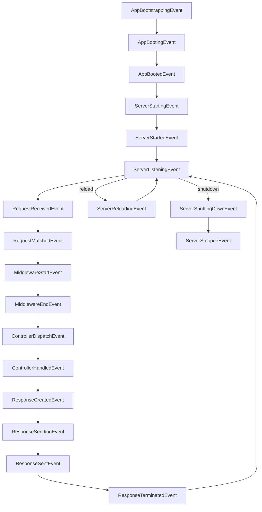

## 🟢 App Events (Bootstrapping)

Prefix: `Swilen\Arthropod\Events\`

* `AppBootstrappingEvent`
* `AppBootingEvent`
* `AppBootedEvent`

---

## 🔵 Server Events (Daemon)

Prefix: `Swilen\Arthropod\Events\`

* `ServerStartingEvent`
* `ServerStartedEvent`
* `ServerListeningEvent`
* `ServerReloadingEvent`
* `ServerShuttingDownEvent`
* `ServerStoppedEvent`

---

## 🟣 HTTP Cycle Events

Prefix: `Swilen\Http\Events\`

* `RequestReceivedEvent`
* `RequestMatchedEvent`
* `MiddlewareStartEvent`
* `MiddlewareEndEvent`
* `ControllerDispatchEvent`
* `ControllerHandledEvent`
* `ResponseCreatedEvent`
* `ResponseSendingEvent`
* `ResponseSentEvent`
* `ResponseTerminatedEvent`

---

# 📄 Complete Lifecycle Documentation

```md
# Application & Server Lifecycle

This document describes the full lifecycle from application bootstrap to server shutdown.

The system is divided into three layers:

1. Application lifecycle (bootstrapping)
2. Server lifecycle (daemon)
3. HTTP request lifecycle (per request)

---

# 1. Application Lifecycle

Namespace: Swilen\Arthropod\Events

## Events

- AppBootstrappingEvent
- AppBootingEvent
- AppBootedEvent

## Flow

AppBootstrappingEvent
→ AppBootingEvent
→ AppBootedEvent

## Description

### AppBootstrappingEvent
- Very early stage
- Load environment variables
- Initialize base container

### AppBootingEvent
- Register service providers
- Bind interfaces
- Configure core services

### AppBootedEvent
- Application fully initialized
- Ready to start server

---

# 2. Server Lifecycle (Daemon)

Namespace: Swilen\Arthropod\Events

## Events

- ServerStartingEvent
- ServerStartedEvent
- ServerListeningEvent
- ServerReloadingEvent
- ServerShuttingDownEvent
- ServerStoppedEvent

## Flow

ServerStartingEvent
→ ServerStartedEvent
→ ServerListeningEvent

(loop: handle requests)

→ ServerReloadingEvent (optional)
→ ServerShuttingDownEvent
→ ServerStoppedEvent

## Description

### ServerStartingEvent
- Swoole server instance created
- Configuration applied

### ServerStartedEvent
- Server process started

### ServerListeningEvent
- Server is listening on host/port
- Ready to accept connections

### ServerReloadingEvent
- Workers reloading (hot reload)

### ServerShuttingDownEvent
- Graceful shutdown begins
- Stop accepting new requests

### ServerStoppedEvent
- All workers stopped
- Server fully terminated

---

# 3. HTTP Request Lifecycle

Namespace: Swilen\Http\Events

## Events

- RequestReceivedEvent
- RequestMatchedEvent
- MiddlewareStartEvent
- MiddlewareEndEvent
- ControllerDispatchEvent
- ControllerHandledEvent
- ResponseCreatedEvent
- ResponseSendingEvent
- ResponseSentEvent
- ResponseTerminatedEvent

## Flow (Per Request)

RequestReceivedEvent
→ RequestMatchedEvent
→ MiddlewareStartEvent
→ MiddlewareEndEvent
→ ControllerDispatchEvent
→ ControllerHandledEvent
→ ResponseCreatedEvent
→ ResponseSendingEvent
→ ResponseSentEvent
→ ResponseTerminatedEvent

---

## Description

### RequestReceivedEvent
- Raw request arrives from Swoole
- Request object created

### RequestMatchedEvent
- Router resolves route
- Controller + middleware assigned

### MiddlewareStartEvent / MiddlewareEndEvent
- Middleware pipeline executes
- Can short-circuit request

### ControllerDispatchEvent
- Controller action invoked

### ControllerHandledEvent
- Controller returns response data

### ResponseCreatedEvent
- Response object built

### ResponseSendingEvent
- Headers/body about to be sent

### ResponseSentEvent
- Response fully sent to client

### ResponseTerminatedEvent
- Post-response logic
- Logging, queues, cleanup
- Equivalent to Laravel terminable middleware

---

# 4. Full System Flow

AppBootstrappingEvent
→ AppBootingEvent
→ AppBootedEvent

→ ServerStartingEvent
→ ServerStartedEvent
→ ServerListeningEvent

→ (Request lifecycle repeated per request)

→ ServerReloadingEvent (optional)

→ ServerShuttingDownEvent
→ ServerStoppedEvent

---

# 5. Notes

- App lifecycle runs once per process
- Server lifecycle manages the daemon
- HTTP lifecycle runs per request
- Events are synchronous by default but can be async in Swoole
- Middleware may interrupt normal flow

```

---

# 📊 Diagram

Here’s a **full lifecycle diagram** you can drop into docs:



---